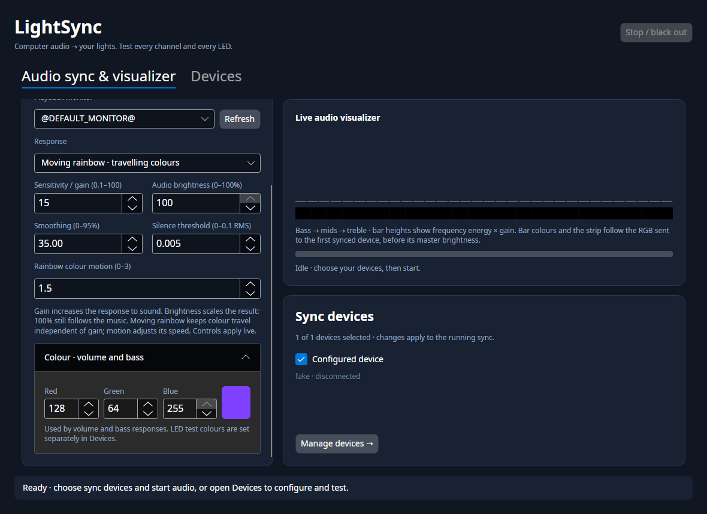
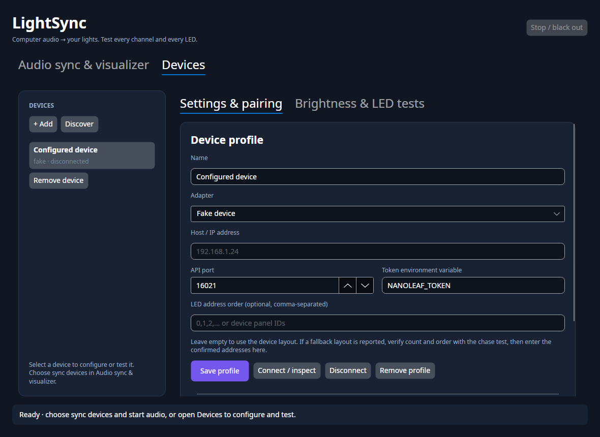
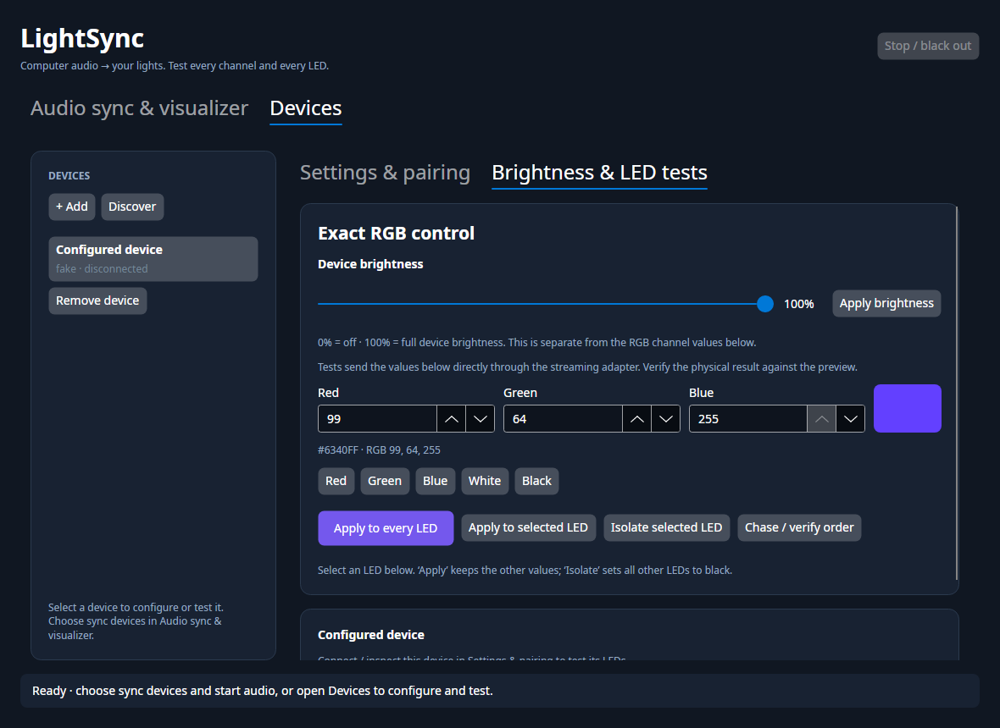
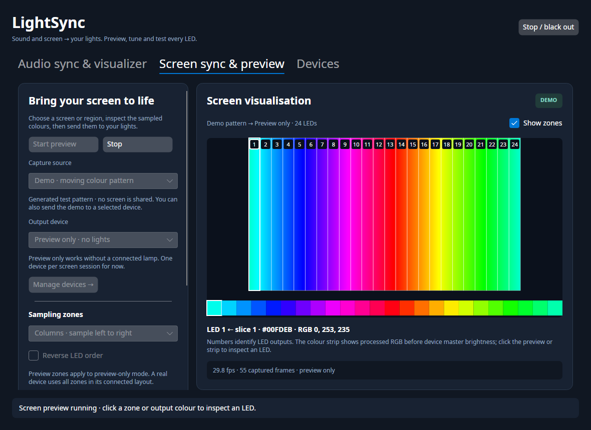

# Desktop studio, audio and screen sync

Run from the repository root:

```bash
dotnet run --project src/LightSync.Desktop
```

The Linux desktop uses Avalonia 12. Install .NET 10 and PulseAudio tools (`parec`
and `pactl`, commonly `pulseaudio-utils` or `libpulse`). PipeWire users need its
PulseAudio compatibility server. Audio capture follows computer playback rather
than the microphone; it does not open a screen-sharing picker.

## Navigation

The interface has three top-level sections:

- **Audio sync & visualizer**: playback monitor, response, gain, audio brightness,
  smoothing, rainbow motion, fixed audio colour, live visualizer and sync device
  selection. The visualizer stays visible beside the tuning controls.
- **Screen sync & preview**: screen/region selection, saved capture area, demo
  source, output device, sampling zones, colour response and a live screen preview
  with an LED output strip.
- **Devices**: add, discover, select and remove profiles. **Settings & pairing**
  contains connection details and authentication; **Brightness & LED tests**
  contains master brightness, exact RGB tests and LED order verification.

Switching sections preserves tuning and keeps an active sync session running.
**Manage devices →** opens Devices from either sync page. Device editing and LED
experiments require stopping sync; removing a profile or changing audio sync
selection can still update a running audio session.

Screenshots below use an isolated simulated device configuration.





## Devices

The left list in **Devices** contains saved profiles. Select a device to edit or
test it. The first launch imports the existing CLI configuration's device. **Discover Nanoleaf** finds Nanoleaf devices via mDNS; **Add**
creates a profile manually. Host, API port, token environment variable and LED
address order live in **Devices → Settings & pairing**.

Uncheck a device under **Audio sync & visualizer → Sync devices** to keep its
profile while excluding it from audio.
**Remove device** is visible on every row and deletes the saved profile, blacks
out and disconnects that device. Both controls work during sync: capture briefly
restarts for the remaining checked devices. Removing or unchecking the last
device stops sync. Token files are retained for reuse.

Nanoleaf, OpenRGB and the simulated adapter are implemented. WLED and Hue appear
as planned and cannot be connected until their adapters are implemented.
**Discover PC components** enumerates OpenRGB's SDK server and adds a profile for
each controller. Discovery and connection automatically open local OpenRGB with
its SDK server enabled when it is installed but not running, then wait for it
to become ready. Existing servers are reused; remote servers must be started on
their own computer. OpenRGB profiles show server and controller settings without
Nanoleaf pairing controls. The discovery buttons share a row above the device
list and settings. Progress and results appear directly below the buttons,
including server connection failures, empty results and already saved devices.
See the [OpenRGB guide](OPENRGB.md) for setup and current
limitations. Master brightness controls appear only for connected devices that
support master brightness.

Save the profile before testing. **Connect / inspect** loads the device's
capabilities and address order. For new Nanoleaf devices, arm pairing physically,
then click **Pair & save token**. Matter Essentials uses **Connect to API** in the
Nanoleaf app; other models may use the power button. Each newly paired profile
gets a separate owner-only token file. Existing CLI credentials still work, and
an explicitly configured token environment variable takes precedence over files.

Profiles are saved at `~/.config/light-sync/devices.json` (or under
`$XDG_CONFIG_HOME`). Audio and screen settings use separate sections of the
existing `config.json`. Secrets are kept separately in `*.local.json` files.

## Verify RGB and LED order



The **Device brightness** slider runs from **0 to 100%**. Click **Apply brightness**
to send and save it for the selected device: 0% switches off, 100% is full master
brightness. This is separate from the RGB channels (0–255) and the audio output
brightness multiplier. Stop audio sync before editing the device brightness.
Nanoleaf streaming restores the chosen master brightness after blackout rather
than inheriting the low brightness used by the off command.

1. Select and connect one device, then open **Brightness & LED tests**.
2. Choose red, green, blue, white, and black in turn. Click **Apply to every LED**
   for each preset. Look for swapped channels, missing LEDs or nonuniform output.
3. Enter arbitrary RGB values (0–255), such as 1, 127, 254. The swatch and hex value
   show the exact requested bytes.
4. Select an LED tile. **Apply to selected LED** changes only that zone while
   preserving the other requested values. **Isolate selected LED** blacks out all
   others. Tile labels show the frame index, physical address, and requested RGB.
5. Run **Chase / verify order** with a visible colour. One LED lights at a time,
   with its address shown, to verify count and physical order. The sequence ends
   in black; **Stop / black out** interrupts it.
6. If necessary, enter the complete verified address sequence in **Settings &
   pairing**, save and reconnect. Duplicate and out-of-range IDs are rejected.

Tests stream raw RGB frames and refresh them at 10 fps. They bypass screen colour
processing, brightness multipliers, smoothing and HSV conversion. Nanoleaf frames
must contain exactly one colour per configured LED; incomplete or oversized
frames are rejected rather than silently truncated.

These controls verify what the application requests and what its protocol sends.
UDP streaming has no per-frame acknowledgement or colour readback. The tiles are
requested values, not measured LED output. Firmware, LED gamut and hardware
calibration can affect the physical colour. In particular, a **sequential
fallback** layout is inferred, so verify its count and order on the real device.

## Audio

If the app is already open after updating the source, close it and relaunch:

```bash
dotnet run --project src/LightSync.Desktop -c Release
```

Build first before using `--no-build`; that flag runs the last compiled version.


In **Audio sync & visualizer**, check the devices to synchronize, choose an
output monitor, play sound and click **Start audio sync**. The default monitor is the default audio output when capture
starts. After changing output devices, stop, refresh monitors and start again.

| Response | Behaviour |
|---|---|
| Moving rainbow | A travelling rainbow follows raw audio energy and bass attacks, with an independent motion control. Gain controls intensity through a soft shoulder so strong signals retain variation instead of hard clipping. |
| Spectrum | Bass drives red at the beginning of the strip, mids green in the middle, treble blue at the end. |
| Volume | The chosen RGB colour's brightness follows total RMS level. |
| Bass pulse | The chosen RGB colour's brightness follows bass energy, often emphasizing kick drums. This is an energy response rather than a beat/BPM detector. |

Gain adjusts sensitivity, brightness limits the output, smoothing softens changes,
and the silence threshold prevents a low noise floor from keeping LEDs lit.
Volume and bass use the colour selected under **Colour · volume and bass** in
the audio section. Changing a colour in Devices only affects LED tests. Audio
colour loads from and saves to `audio.color`; existing saved colours carry over.
Numeric fields use compact, vertically stacked arrow buttons and larger text so
three-digit RGB values remain readable at the minimum window width. You can type
an exact value directly or use the arrows to adjust it.
All checked devices share one capture and the same response across their full
lengths. Response, gain, brightness, smoothing, gate, rainbow motion and audio
colour controls apply live. Settings are saved on start, stop, device sync membership changes and window
close. Existing profiles keep their selected response; select **Moving rainbow**
to try the new effect.

The visualizer shows 32 logarithmic frequency bands from the FFT. Bar heights
show energy scaled by gain; bar colours sample the same requested LED frame as
the RGB strip below them. Both follow the selected response, including live
mode changes, fixed audio colour, output brightness and smoothing. Volume and
bass use the selected audio colour; rainbow travels with the strip; spectrum
follows its red/green/blue regions. The preview uses the first checked device
and updates every three captured blocks (about 15.6 times per second at 48 kHz
with 1024-sample blocks, before capture/send overhead). Bars can reach their
ceiling without freezing rainbow hue movement.
The preview precedes the device master brightness; it is not measured output.
The live meter shows amplified RMS and numeric raw band energies. Silence fades
to black. Stop, capture failure or window close attempts to black out the devices and releases audio capture.

Audio is the CLI default too:

```bash
dotnet run --project src/LightSync.Cli -- run
# Optional screen mode remains available:
dotnet run --project src/LightSync.Cli -- run --source screen
```

The CLI uses its single configured `device`; multiple saved profiles and selection
are managed in the desktop studio. Run one controller per physical device while
verifying its colours.

## Screen sync



Open **Screen sync & preview**. With multiple enabled devices, the default output
is **All enabled devices**, using the checked sync device profiles from audio.
Choose **Preview only** to inspect screen colours without
connecting a lamp. To try the interface without screen sharing, select
**Demo · moving colour pattern** and click **Start preview**.
Select a saved device under **Output device** to send the same source to its LEDs.
Choose **All enabled devices** to send one captured source to all checked devices.
Each device samples the screen using its own LED count, with independent output
queues so a slow or failing device does not freeze the others. The visualisation
shows the first device's zones. Single-device selection remains available.

**Choose screen / region…** opens the Linux desktop's screen-sharing picker and
captures the whole selection. A successful first preview saves its dimensions and
restore token when you stop, start another session or close the app. **Use saved
capture area** uses the CLI's saved area and token; the desktop may still ask for
sharing approval. A demo run preserves the saved capture area. Real capture uses
the existing Wayland portal, PipeWire and GStreamer backend; install the screen
capture dependencies listed in [SETUP.md](SETUP.md). The demo also works on other
desktop platforms.

The image shows the captured source, downscaled to fit 640 × 360 pixels, with its
aspect ratio preserved for fresh selections. Column or row boundaries match the
processor's sampling slices. Numbers identify LED outputs and reversal changes
which slice feeds each output. Narrow zones stagger their numbers across rows or
columns so single- and two-digit labels remain visible together. At very high
zone counts, evenly spaced labels are shown along with the last slice and the
selected LED; every zone is still processed. Click a slice or the colour strip to
inspect the LED number, slice, hex colour and exact RGB bytes. The strip shows processed colours before
device master brightness, rather than measured lamp output. Toggle **Show zones**
to view the source without the overlay.

A selected device uses its complete connected zone count. **Preview zones** only
sets the count for preview-only mode. The saved CLI custom order is respected;
when one exists, layout and reversal are locked and the output count must match
that order. Brightness, saturation, smoothing, averaging and frame rate are adjustable before
starting. Existing gamma and black-level settings remain in use.
For white-heavy browser content, **Colour weighted** gives colourful pixels priority
and falls back to luminance weighting for entirely grey/white zones. Try saturation
at **120–140%** for a stronger colour response. These settings affect the LED strip
and lights; the captured image retains the source colours.
Window capture follows resized content, preserving its proportions with black
borders in the preview canvas. Saved screen rectangles are not applied again to
window or region streams that the portal already cropped.
If capture stops delivering frames for three seconds, the reader reconnects to
the same authorized source and the preview displays **RECOVERING**. On Hyprland,
source keepalive is disabled so repeated stale pixels cannot hide the portal's
resize stall. Recovery makes up to three attempts, each with a ten-second startup
deadline, then reports a capture error if the source remains unavailable.
The observed Hyprland resize stall matches upstream fixes
[#424](https://github.com/hyprwm/xdg-desktop-portal-hyprland/pull/424) and
[#425](https://github.com/hyprwm/xdg-desktop-portal-hyprland/pull/425), where buffer
retry and renegotiation destroyed the next frame callback. Reconnection obtains
a fresh PipeWire remote from the existing portal session; it does not reuse the
old protocol socket or reopen the source picker.
Stop before changing settings, then start again to apply them. Screen settings
save in `capture`, `mapping` and `processing`; audio tuning remains independent.

The preview refreshes at up to 10 Hz using one reusable snapshot. Device output
continues through the CLI's capture/processing pipeline, where slow output drops
old frames instead of building latency. The last device error appears in the
status bar, and a screen source ending is reported as a capture failure.
Stop or window close releases capture, clears the screen image and attempts to
black out all selected devices. Device editing and audio startup are disabled
until screen capture stops; navigating between tabs keeps capture running.

Verification: Release build with zero warnings, all 284 existing tests passed,
and a temporary isolated Avalonia headless harness covered preview-only capture, simulated
device output, RGB brightness, reversed row selection, overlay toggling,
navigation, persistence, stopping and window close. Label visibility was checked
from rendered screenshots at normal and minimum window sizes, with landscape and
portrait sources and both sampling layouts. These GUI checks are not a checked-in
automated regression suite. Screenshots use the generated demo source. The user
confirmed Screen Sync output working on 2026-10-02; live portal selection and
physical device output are not part of the automated checks.

Latest regression checks: 305 tests passed with no skips and a Release build with
zero warnings. Recovery tests cover repeated stalls, bounded retries, cancellation,
monotonic preview sequences and cancellation of a real stalled GStreamer pipeline.
Multi-device tests cover different LED counts and slow/failing peripherals. An
isolated headless desktop smoke check covered all-enabled selection, 24/8 LED
mapping, exclusion of a disabled profile, colour controls, status, single-device
selection and blackout of every active output. The user confirmed the updated
screen sync working on 2026-10-02.

## Tuning impact and movement

Gain and brightness both influence perceived intensity, but serve different jobs.
Gain makes quiet audio more responsive; output brightness multiplies the result.
100% brightness still follows the music, including fading to black in silence.
The device's own 0–100% master setting scales that output again.

The original spectrum mode keeps the red/green/blue regions in fixed positions.
High gain can clamp those regions to full intensity, hiding smaller musical
changes. Moving rainbow separates colour travel from gain and keeps a soft
brightness shoulder above half intensity. It follows audio energy and bass
attacks rather than detecting tempo or beats. Motion 0 stops travel; spectral
balance can still change the palette offset.

If gain around 15 provides the impact you like, keep it, select **Moving rainbow**,
and adjust **Rainbow colour motion** separately. A starting preset for this
setup is gain **15**, motion **1.5**, smoothing **35%**, audio brightness **100%**,
device brightness **100%** and silence threshold **0.005**. These are recommended
starting values, not automatic volume normalization. Lower smoothing for sharper
changes. Compare several songs because raw energy and frequency
balance depend on the recording. The visualizer helps distinguish low input
energy, amplified meter clipping and the requested LED colour changes.

## Validated setup

On 2026-10-01 the user confirmed computer-audio sync, the Avalonia interface and
0–100% device brightness working on the Nanoleaf setup described in
[NANOLEAF_PROTOCOL.md](NANOLEAF_PROTOCOL.md). The moving rainbow, visualizer and
live device removal were added after that confirmation; their perceived effect
still needs feedback on the physical lamp.

Verification on 2026-10-01: Release build **0 warnings**, **284 tests passed**,
**0 skipped**, CLI Native AOT publish and help succeeded. A three-second native
audio smoke test captured playback through `parec` into the simulated 24-zone
device, reported frames and exited cleanly on SIGTERM.

The separate sections were also checked with an isolated Avalonia headless
session: tab visibility, tuning preserved across navigation, independent audio
and test colours, removal persisted to `devices.json`, and all 32 rendered bar
colours matching the reported LED frame and output strip while switching through
all four response modes. These checks use a simulated profile; screenshots show
the actual rendered interface.

Numeric field layout was checked at 940 × 760 and 1180 × 860: `255` fits in all
six audio/test RGB fields, and the silence threshold displays `0.005` in full.
These UI checks run in a temporary headless review harness, separate from the
checked-in unit test suite.

Automated tests cover audio frequency separation, stereo phase
cancellation, silence, live settings, rainbow motion independent of gain, exact
Nanoleaf UDP bytes, master brightness and shutdown cleanup. CLI Native AOT
publication is checked separately. Automated tests use simulated devices and
loopback transports, not real credentials or hardware.
